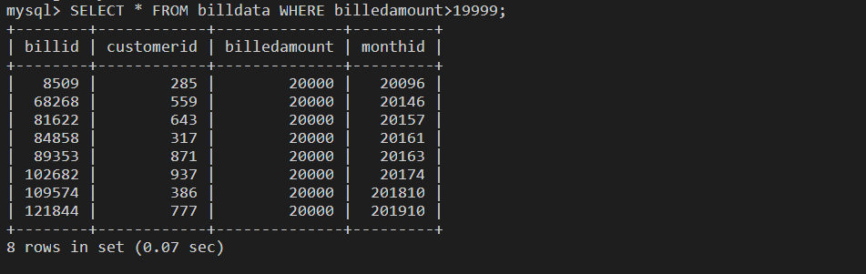

# DBA using Mysql and Postgres

### Overview

For this project you will assume the role of database administrator at a data analytics consulting company. You have been assigned to a project where you need to setup, test and optimize the data platform. The platform contains different on premises database servers like MySQL, PostgreSQL, and cloud-based databases like IBM DB2. Your job is to configure, tune, secure, backup and monitor those databases and keep them running at peak performance.

- You will work with PostgreSQL server and perform the User Management tasks and handle the backup of the databases.

- You will work with MySQL server and perform the tasks like configuration check, recovery of data. You will use indexing to improve the database performance. You will identify which storage engines are supported by the server and which table uses which storage engine. Optionally you will also automate backup tasks.

- You will work with the cloud instance of IBM DB2 server and perform the tasks like restoration of data, index creation to improve the query performance. You will create views to make queries easier to write. Optionally you will also connect to the cloud instance of IBM DB2 server and from command line.

Find the settings in PostgreSQL (1 pts)

Create an User (1 pts)

Create a Role (1 pts)

Grant privileges to the role (2 pts)

Grant role to an user (1 pts)

Backup a database on PostgreSQL server (1 pts)

Restore MySQL server using a previous backup (1 pts)

Find the table data size (1 pts)

Baseline query performance (1 pts)

Create an index. (1 pts)

Document the improvement in query performance. (1 pts)

Find supported storage engines (1 pts)

Find the storage engine of a table (1 pts)

Restore the table billing. (2 pts)

Create a view named basicbilldetails with the columns customerid, month, billedamount. (1 pts)

Baseline query performance. (1 pts)

Create an index. (1 pts)

Document the improvement in query performance. (1 pts)

